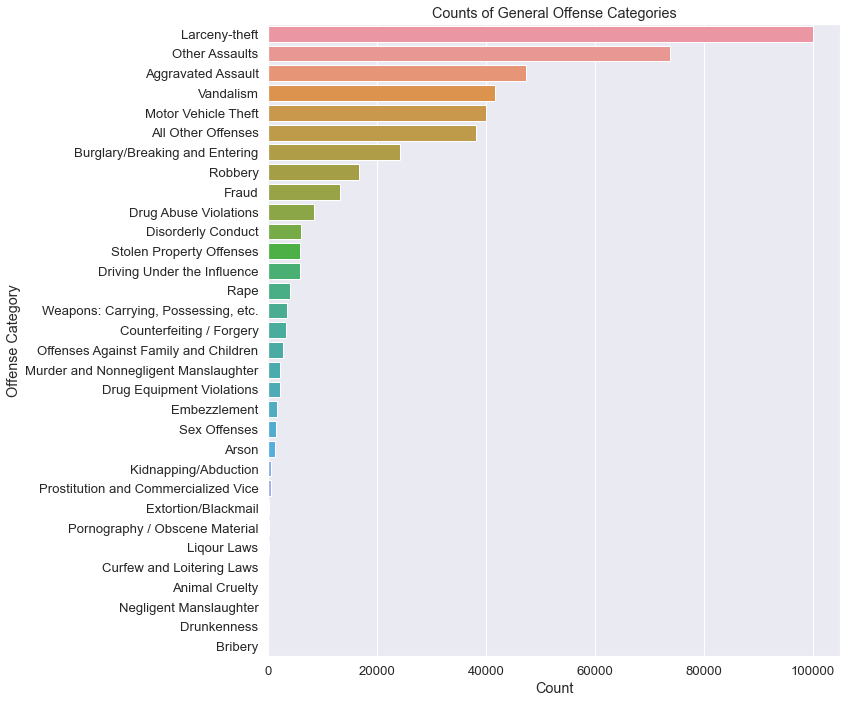
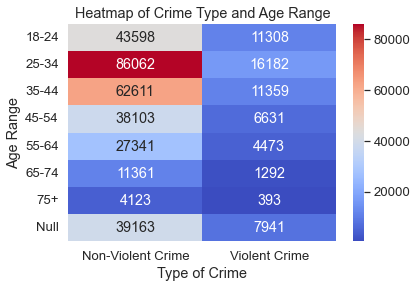
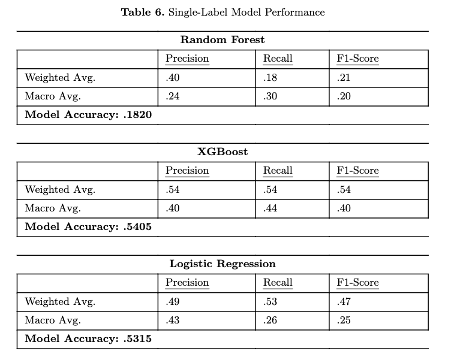
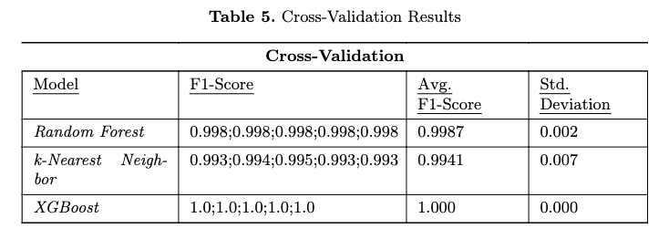
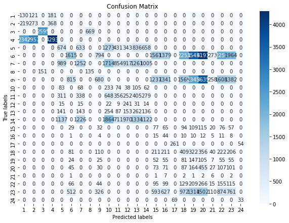
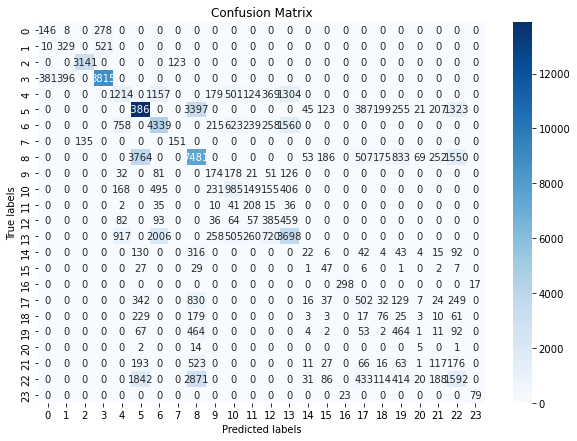
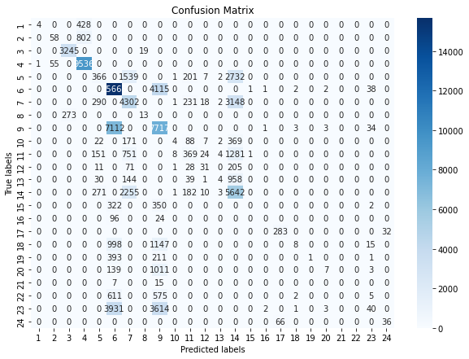

# Analyzing Crime Dynamics in Kansas City: A Study on Violent and Non-Violent Offenses Using Machine Learning

## Project Overview
The objective of this project is to leverage the KCPD_5_Year_Analysis data set supplied by the Board of Police Commissioners of Kansas City, Missouri to be open data used by the public within Open Data KC. This data set contains reports surrounding criminal offenses within the Kansas City Metropolitan area. 

## Project Goal
The goal is to leverage machine learning algorithms to break down time series data provided within the data set to understand and predict the likelihood of age groups becoming a victim of a crime and the most common times of year, quarter, month, and day of the week in which individuals within the Kansas City metropolitan region has a more significant likelihood of becoming a victim of a crime and provide a predictive model that can iterate to provide a proactive solution and understanding of the trends that have been occurring over the past five years. 

## Project Prerequisities
1. Git
1. Python 3.7 + (3.11+ Preferred)
1. VS Code Editor
1. VS Code Extension: Python (by Microsoft)

## Getting Started 
1. Fork this repo into your GitHub.
1. Clone your repo down to your machine.
1. View/ Command Palette - then Python: Select Interpreter
1. Select your conda environment
1. Install necessary libraries listed below and within the `requirements.txt` file using `pip install -r requirements.txt` **Instructions below for Virtual Environment Set-up**

### Virtual Environment Set Up
For those wanting to use a Virtual Environment run the following in a terminal:
1. Run the command `python3 -m venv venv`
1. Activate the virtual environment
    1. On Windows: `.\venv\Scripts\activate`
    1. On macOS and Linux `source venv/bin/activate`
1. Ensure the environment is activate and then install the packages listed in `requirements.text` by running: `pip install -r requirements.txt`

## Project Libraries
- Pandas:
    - Provides DataFrame object for data manipulation and integrated indexing.
    - Tools for reading and writing data for the CSV files within this project. 
- matplotlib.pyplot
    - Comprehensive library for creating static, animated, and interactive visualizations.
    - Provides a wide variety of plots and plotting functions.
- NumPy
    - Provides high-performance multidimensional array object, and tools for working with these arrays
    - Key library for computing in Python
- nbformat
    - Package that defines the struction of Jupyter Notebooks.
- Seaborn
    - Visualization library built on matplotlib that provides visualization functions for displaying complex statistical relationships.
- scikit learn
    - Provides Simple and Efficient Tools for Predictive Data Analysis
    - Built on NumPy, SciPy, and matplotlib

## Project Files

- **Crime_Analysis_EDA.ipynb**: this is the file that contains the necessary information for the exploratory data analysis. This will leverage python pyplot, pandas, pandas scatter_matrix to provide the initial data analysis within python. 
- **Crime_Analysis_Pre_Processing.ipynb**: this is the file that contains the steps to handle the pre-processing portion of the data set - specifically the custom imputation.
- **Crime_Analysis_Feature_Eng.ipynb**: this is the file that contains the code that deals with the feature engineering portion of the data set
- **Crime_Analysis_Modeling.ipynb**: this is the file that contains the model detail inforamtion and the train/test set information and the comparison of the models. 
- **Crime_Analysis_Neural_Net.ipynb**: this is the file that contains the model deployment of a neural net.

## Exploratory Data Analysis
Used to conduct the EDA of the data set and understand the relationships and correlations of the data set through various visualizations using the *matplotlib & Seaborn* libraries.

**Key Features: General Offense Rank & Age Range**

## Models

### Multi-Label Classification Models
- **Random Forest**:
    - Constructs multiple decision "trees" hence the forest during the training time and outputting the classes. It is less likely to overfit than a single decision tree. 
- **K-Nearest Neighbors (k-NN)**: 
    - k-NN, stores all available cases and classifies new cases based on a similarity measure. It is non-parametric, meaning no underlying assumptions about the distribution of data.
- **XGBoost**: 
    - XGBoost or eXtreme Gradient Boosting is highly efficient, flexible, and portable. It provides parallel tree boosting.

! [Multi-label](Screenshots/Model-multi.png)

### Single-Label Classification Models
- **Random Forest**:
    - Constructs multiple decision "trees" hence the forest during the training time and outputting the classes. It is less likely to overfit than a single decision tree. 
- **XGBoost**: 
    - XGBoost or eXtreme Gradient Boosting is highly efficient, flexible, and portable. It provides parallel tree boosting.
- **Logistic Regression**:
    - Logistic regression is a supervised learning algorithm used with binary classification problems
- **Neural Net**:
    - Neural Network are machine learning programs that consist of layers or nodes or artifical neurons. It relies on training data to learn and improve their accuracy over time.

## Statistical Methods
- **Cross-Validation**: used to estimate the skill of machine learning models. It is a re-sampling procedure used to evaluate models on a limited data sample. It uses a single parameter *k* - that refers to the number of groups each data sample will be split into. The process is repeated *k* times, each with a different fold treated as the validation set. 

- **Confusion Matrix of Single-Label Models**: The confusion matrixs were plotted using matplotlib & seaborn libraries for the model's confusion matrix to review the performance of the single-label model performance. 

**Random Forest Confusion Matrix**

**XGBoost Confusion Matrix**

**Logistic Regression Confusion Matrix**
